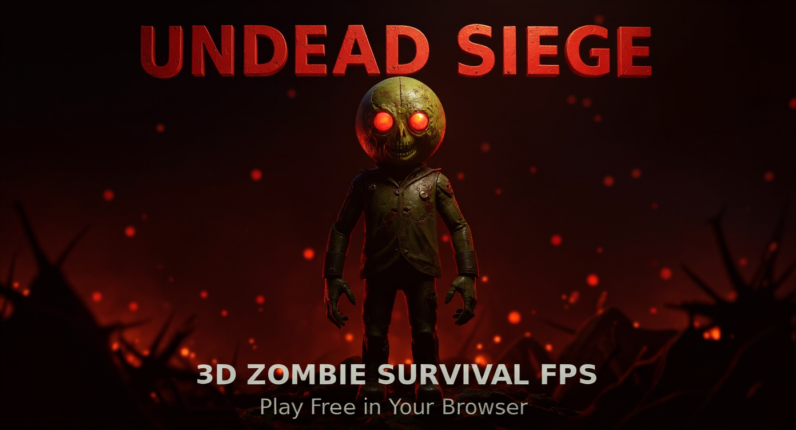

# 🧟 UNDEAD SIEGE 3D

### A love letter to Call of Duty Zombies — built entirely through AI conversation

<div align="center">

<a href="https://itsababseh.github.io/undead-siege-3d/">
  
  <br/>
  
</a>

</div>

---

## 🤝 Connect and Share

Found a bug? Hit a crazy high score? Have an idea that would make this wilder? Drop me a message — I read everything and build improvements based on what the community surfaces.

<div align="center">

<a href="https://x.com/whatdoesababsay"></a>&nbsp;&nbsp;&nbsp;<a href="https://www.linkedin.com/in/johnababseh/"></a>

</div>

> *"Games are community, and communities should be able to help games in real time be better."*


## 🔫 Features

### Combat & Weapons
- **4 Iconic Weapons** — M1911 (starter), MP40, Trench Gun, Ray Gun — each with unique recoil profile, muzzle flash, and tracer
- **Mystery Box** — Spend 950 points for a random weapon drop with animated spin reveal; 8-second collect window; rolling the gun you already hold gives you a free max-ammo refill instead. Each weapon has a recognizable procedural mini-mesh preview (M1911 grip, MP40 silhouette, Trench Gun stock, glowing Ray Gun coil). 8% chance the box refuses with an **octopus jump-scare** that screams, lunges at the camera, then teleports the box elsewhere — classic "teddy bear" homage
- **Pack-a-Punch** — Upgrade any weapon for 5000 points: boosted damage, bigger mags, animated camo & graffiti overlay
- **Knife System** — Dedicated melee attack with swing animation, cooldown, and satisfying slash SFX
- **Weapon Quick-Swap** — Press Q to instantly toggle between your last two weapons
- **Per-Weapon Recoil** — Every gun has hand-tuned kick, barrel rise, and settle behavior
- **Sprint** — Hold Shift while moving forward to run at 1.45× speed. Faster head-bob cadence, subtle FOV widen, and the gun lowers CoD-style to signal you're in motion
- **Last Stand (multiplayer only)** — When a teammate's HP hits 0 in MP, they drop to a prone pistol-only crawl. They can still move slowly and shoot the M1911 while waiting for a teammate to revive them. Solo: HP zero is final — there's nobody to revive you

### Perks (90s timed duration unless noted, CoD-style)
- **🛡️ Juggernog** — 3-hit absorbing shield. Zombies eat the shield before your HP (2500 pts)
- **❤️ Health** — Permanent +75 max HP for the rest of the run (2500 pts, no timer)
- **⚡ Speed Cola** — 2× faster reload (3000 pts)
- **🔥 Double Tap** — 2× fire rate (2000 pts)
- **💉 Quick Revive** — HP regen + 4× faster ally revives (1500 pts)
- **Stylized HUD Pills** — Each perk appears as a pill-shaped button with emoji, label, time-drain fill, and pulsing warning when <5s remain
- **Down = Wipe** — Timed buffs clear when you go down. Permanent perks (Health) survive

### Enemies & AI
- **Boarded-Up Windows** — 14 barricaded windows around the bunker perimeter (N/S/E/W walls). Zombies pour in through them, beating the planks off one at a time before climbing through with a sine-arc vault tween. A loud low **BANG** plays when the first attacker reaches a quiet window so you know which board is under attack; a brown dust-puff bursts when the last plank falls
- **Window Repair** — Stand near a damaged window and hold E to nail the planks back on (10 pts each). Zombies will tear them right back down, classic CoD flow
- **Player-Aware Spawn Bias** — Window picker scores by `attackerCount × 8 + tilesToNearestPlayer + jitter` so the horde visibly crashes through whichever boards your squad is defending
- **Dynamic Pathfinding** — Wall collision with body-radius margin so zombies never clip through geometry
- **Separation Forces** — Boid-like horde behavior so zombies don't stack on top of each other
- **Stuck Detection + Nudge** — Line-of-sight checked teleport that never tunnels through walls
- **Per-Zombie Staleness Watchdog** — Genuinely unreachable zombies (corner-stuck, sealed-area edge cases) get progressively rescued at 25 / 40 / 60s of zero movement: rage (boost speed + warp near player), warp (hard-teleport within 6 tiles), cull (delete + credit). Only triggers on demonstrably stuck zombies — actively chasing ones reset their own probe every frame
- **No-Wait End of Round** — When zombies.length hits 0 with spawns still owed, spawnTimer is forced to 0; the very last zombie of every round spawns at the closest window's inside-bunker landing AND sprints (1.15-1.35× speed) so you engage within ~2 seconds of the previous kill, regardless of slow-shamble RNG
- **Boss Zombies** — Every 5th round spawns a boss with ground pound, zigzag, and phase-based abilities
- **Elite Zombies** — 15% chance past round 3: 2.5× HP, 1.15× speed, 1.8× damage
- **Limping System** — Damaged zombies develop randomized limps that affect their stride
- **Tier System** — CoD-style difficulty jumps every 5 rounds (speed, HP, damage scaling)
- **Zone-Aware Spawning** — Zombies never spawn in sealed rooms (West Wing / East Chamber) before their doors are bought

### World & Exploration
- **Full 3D Environment** — Three.js-powered with textured walls, floors, cinematic fog, and atmospheric lighting
- **Buyable Doors** — West Wing (1250 pts) & East Chamber (2000 pts) unlock new areas with fresh spawn points. The west door clears BOTH the door cell AND the green barracks wall behind it in one open, so you can actually enter — no more 1-tile pocket where zombies got trapped
- **9 Cinematic Wall Posters** — Hand-drawn easter-egg posters scattered around the map (Get Better Mom, Sunday Ball, AutoGPT homage, etc.). Each gets its own warm point-light so they're legible in dark corners. Personal memories baked into the bunker walls — find them all
- **Power-Up Drops** — Nuke, Insta-Kill, Double Points, Max Ammo with stylized animated pill UI. Drop rate scales with the round and a pity timer guarantees one every 18 kills so dry streaks are impossible. Power-ups now drop in MP too (was SP-only)
- **Vibe Jam Portals** — Interdimensional caution-tape portal built into the wall that transports you to other Vibe Jam 2026 games. Hit browser back to resume your run — SP resumes paused on the same round, MP attempts to rejoin the lobby or shows the squad-wipe summary
- **Subtle Cinematic Vignette** — Always-on film-style edge falloff that doesn't darken gameplay
- **Progressive Low-HP Tint** — Screen edges tint red as your HP drops (quadratic curve below 60%). Critical heartbeat pulse kicks in under 15%

### Multiplayer (real-time up to 5 players)
- **Lobby System** — Create public/private, join by invite code, or browse the public lobby list. Invite links survive a refresh — the join target is mirrored to sessionStorage so even an auth-handshake hiccup doesn't strand you on the menu
- **Host Authority + Migration** — One client per lobby runs zombie AI and streams positions at 20 Hz; HP is server-authoritative via SpacetimeDB. If the host quits or crashes, any non-host's heartbeat-claim succeeds within ~10s and authority migrates seamlessly. The new host's local zombies are flipped to authoritative ownership (no echoed-position fight); the ex-host's zombies become server-driven mirrors. A `⚠ HOST DISCONNECTED — finding new host…` overlay surfaces during the gap, then a "X is now the host" toast confirms migration
- **Player Names** — Push to the server on connect (no more "Survivor" everywhere). If you never set a name, an auto-generated `Player-####` is stored on first run so squads always have distinct identifiers
- **Synced Weapon Models + Downed Visual** — Remote players' soldier models show the actual weapon they're holding. When a teammate goes down, their model drops prone with a `DOWNED` badge above the body and the name tag follows the prone position
- **Downed & Revive** — Go down when HP hits 0, teammates hold E (or tap the on-screen `REVIVE` button on mobile) within 3 units; 2-second post-revive grace window. Quick Revive perk multiplies the fill rate 4×. Zombies immediately drop the downed player from their target list and re-pick a live teammate the next frame
- **Squad-Wipe Screen** — Full run summary + global leaderboard placement + **PLAY SOLO**, **REJOIN LOBBY**, and **Share on X** buttons
- **Spectator Camera** — Mid-match joiners spectate until the next round starts. Camera now smoothly follows the watched teammate (lerped position + shortest-arc yaw) instead of frame-snapping. Press **A / D** to cycle through teammates, or tap left/right side of the screen on mobile. The current target name + position (`2/3`) shows in the overlay
- **Separated Spawn Points** — Each player drops in at a different offset tile so the squad doesn't stack on the host
- **Kill Streaks + Juggernog Flash in MP** — All visual juice (kill-streak banners, shield-absorb flash, screen shake) work in MP, not just SP
- **Ray Gun Splash in MP** — Squad-mode players now get the same splash damage on a Ray Gun direct hit that solo players have always had (per-tick damage routed through the server reducer for HP authority)
- **In-Game Chat** — Press T to type, filtered UI, per-lobby scoped
- **Global MP Leaderboard** — Squad rosters with all player names stored together; top 5 shown on main menu with 👥 prefix for multi-player runs

### Quality of Life
- **5-Second Intro Cinematic** — Plays once per session: letterbox bars, atmospheric subtitle, "ANY KEY SKIP" hint. Multiplayer + portal resume + FIGHT AGAIN all skip to avoid annoying re-plays
- **SP Pause Menu** — Hit ESC in solo to pause + see two extra buttons: **END RUN** (submits your score and shows the death screen) and **MAIN MENU** (abandons and returns to title)
- **Dev-Mode Profiler Overlay** — Toggle with `?profile=1` URL param or `localStorage.undead.profile=1`, then press backtick to show/hide. Lists FPS, frame ms, and per-subsystem timing (spawnZombie, ai:window, ai:chase, eyeLights, particles, render). No-op when disabled — zero overhead for normal play
- **Redesigned Reload UI** — Spinning indicator + countdown + shimmering gradient bar embedded in the ammo box (no more overlapping HUD elements)
- **Minimap** — Real-time tactical overview with zombie positions, doors, perks, and interactable icons
- **Player Ranks** — Earn military ranks (Recruit → Corporal → Sergeant → …) based on cumulative performance
- **Local + Global Leaderboards** — Personal top-5 cached in localStorage; global top-5 streamed from SpacetimeDB
- **Mobile Support** — Full touch controls with virtual joystick, fire button, reload button, weapon switcher, and a **REVIVE** button that appears when a downed teammate is in range. Right-side controls auto-shift inboard on widescreen / foldable landscape devices (aspect ratio ≥ 2:1) so the fire button stays thumb-reachable
- **Procedural Audio** — Every SFX synthesized via Web Audio API (no audio files needed, instant load)
- **Ambient Soundscape** — Dynamic eerie atmosphere that adapts to proximity and gameplay state
- **Radio Transmissions** — Story-driven audio logs triggered on specific rounds
- **Theme-Aware Branding** — Logo auto-switches between light and dark versions to match GitHub reader's theme

### Recently Polished (April 2026)
- **MP host migration + auto-rejoin** — Host quitting / crashing no longer freezes the world. Authority migrates to the next-claiming client within ~10s, local zombie ownership flips cleanly, and a "host disconnected, finding new host…" overlay tells the squad what's happening
- **Mobile MP revive button** — Touch-equivalent of holding E. Auto-appears when a downed teammate is in range; tap-and-hold fills the bar
- **Spectator camera quality pass** — Smooth lerped position + yaw follow (no more frame-snap), A/D cycles teammates on desktop, tap left/right cycles on mobile
- **Mobile fire button widescreen layout** — Foldables and Pro Max landscape get a thumb-reachable cluster instead of a fire button stranded at the screen edge
- **Invite link survives a refresh** — `?invite=CODE` is mirrored to sessionStorage and re-attempted on every page load until the join confirms; the auth-handshake hiccup that used to drop joins is fixed
- **Ray Gun splash in MP** — Squads now get the splash damage SP players have always had; per-tick damage routed through the server reducer
- **Player names propagate on connect** — No more "Survivor" everywhere; auto-generated `Player-####` fallback for users who never typed a name
- **MP zombies switch targets the moment a teammate goes down** — Roster-change detection forces every zombie to re-pick its chase target on the next frame instead of waiting up to a full second
- **West door access fixed** — Opening the west wing now clears BOTH the door and the green barracks wall behind it, so zombies and players can actually enter the room
- **Generators removed** — The undiscoverable easter-egg quest was cut. The BLUE gen at (22,16) had been physically blocking the e-14 window's repair prompt
- **Posters #4 and #9 fixed** — Both were floating in front of east-wall windows; moved one row down so they read on solid wall
- **MP rotation fix at match start + after revive** — `pointerlockerror` listener + delayed checks surface the click-to-refocus hint when pointer-lock requests fail silently due to the no-user-gesture browser rule (the cause of "I can't turn my camera at the start of an MP round")
- **MP "fill your name ↑" arrow direction fixed** — Used to point up; the input is below; flipped to ↓
- **Kill Streak System** — Rapid kills trigger escalating announcements: DOUBLE KILL → TRIPLE KILL → MULTI KILL → **RAMPAGE!!** with increasing screen shake and color intensity. Streak resets 4s after your last kill
- **Juggernog Shield Visual** — Absorbing a hit now triggers a red radial pulse; shield break fires a blue-white burst so you always know the moment you become vulnerable
- **Perk Expiry 2-Stage Warning** — At 15s remaining, an amber "FADING…" float text + descending audio cue tells you to run back to the machine. At 5s, a rapid double-beep warns you it's almost gone. The existing pill pulse at <5s remains
- **Run Stats Card on Death Screen** — After each run you see: Best Weapon, Accuracy %, Knife Kills, and a per-weapon kill breakdown. Resets each new game so stats always reflect the current run
- **Share on X/Twitter** — Death screen now has a one-click tweet button pre-filled with your round, kills, and points
- **Boarded windows + climb-through tween** — 14 barricaded windows around the bunker, each with 6 individually-shattering planks. Zombies now visibly clamber through with a 0.55s sine-arc vault tween, dust puff on breach, and a low BANG when the first attacker reaches a quiet window
- **No more "waiting for the last zombie"** — Layered fixes guarantee the gap between killing one zombie and engaging the next is ≤ ~3 seconds, on every round. Pressure boost (spawnTimer = 0 when nobody's alive), closest-window-inside spawn for the final zombie, sprint speed for the final two spawns, and a critical-end shortcut that warps any window-zombie inside when ≤2 alive
- **Per-zombie staleness watchdog** — Replaced the over-aggressive "no kill in 12s → cull all" logic that was ending rounds when the player took >12s between kills. New version only acts on zombies that haven't actually moved in 25/40/60s, one zombie per frame
- **Particle system → 3 InstancedMesh draw calls** — Pooled blood/dirt/energy particles share three instanced meshes (220 slots each) instead of allocating per-particle Mesh + cloned material. Zero GC churn during boss deaths or simultaneous breaches
- **Static walls merged per color** — buildMap now produces one merged BufferGeometry per material family instead of hundreds of per-tile draw calls. Geometry + material are properly disposed on game restart
- **Mystery box pickup** — Weapon swap is now bulletproof; E presses during spin are buffered so "first time nothing happens" is gone; rolling your current gun is an ammo refill. Held FP gun mesh refresh is forced same-frame so the swap visibly lands
- **Solo → FIGHT AGAIN stays solo** — Death-screen auto-connect (for high-score submission) was leaking SP runs into MP mode (chat HUD, no pause, downed-flow softlock). New `isInActiveMatch()` test gates MP behavior on real lobby presence
- **Brightness tuned for production** — Playable in any lighting condition while preserving the spooky zombie atmosphere
- **Boss round distinction** — Every 5th round now shows a distinctive `⚠ BOSS ROUND N` banner with brighter red glow
- **Gun recoil state fix** — No more stuck-forward gun after the last shot of a round
- **MP death pointer unlock** — Cursor is properly freed on squad wipe so overlay buttons are clickable
- **Chat gating** — T only opens chat during gameplay; lobby presses no longer steal keyboard focus
- **Portal resume** — Hit browser back after using the in-game portal and your run resumes (SP paused at the same round, MP rejoins the lobby if squad's still alive)
- **Sprint** — Hold Shift to run. Gun lowers, FOV widens, bob quickens
- **MP Last Stand** — Downed teammates drop to a prone crawl with a pistol; they can return fire while waiting for a revive (solo death stays final — no one to revive you)
- **Downed-state safeguards** — Portal, weapon swaps, and shop purchases are blocked while downed so a revivable player can't accidentally escape or grief
- **Pause is single-player only** — In MP the world is shared and the server keeps simulating. ESC unlocks the cursor and shows a small "click to refocus" hint at the top of the screen instead of a full pause overlay; you keep taking damage if zombies are on you. SP still pauses fully on ESC

---

## 🎮 Controls

| Action | Desktop | Mobile |
|--------|---------|--------|
| Move | WASD | Virtual Joystick |
| Sprint | Shift | — |
| Look | Mouse | Touch Drag |
| Shoot | Left Click | Fire Button |
| Reload | R | R Button |
| Buy / Interact | E | E Button |
| Knife / Melee | F | F Button |
| Switch Weapons | 1-4 | Weapon Buttons |
| Quick Swap | Q | — |
| Chat (MP) | T | — |
| Pause (SP only) | ESC | — |

---

## ⚙️ Tech Stack

| Layer | Technology |
|-------|-----------|
| 3D Engine | Three.js 0.162 (ES6 modules via CDN importmap) |
| Camera | Custom FPS controller (no PointerLockControls — avoids roll drift) |
| Audio | Web Audio API — 100% procedural, zero audio files |
| Networking | SpacetimeDB real-time multiplayer (Rust backend, WASM reducers) |
| Textures | Procedurally generated canvas textures (no external image assets) |
| Build | esbuild bundler — single inlined HTML, no runtime bundler cost |
| Deployment | GitHub Pages with auto-deploy workflow on push |
| Code | 100% AI-generated through continuous conversation |

---

## 📁 Project Structure

```
undead-siege-3d/
├── index.html                     # Single-file entry point
├── styles/main.css                # All HUD & UI styling
├── src/
│   ├── main.js                    # Game loop, scene init, wiring
│   ├── core/state.js              # Mutable shared state (player, game, entities)
│   ├── audio/index.js             # Web Audio SFX synthesizer
│   ├── entities/zombies.js        # Zombie sprites, AI, animations, eye-light pool
│   ├── models/guns.js             # First-person gun meshes + recoil + PaP camo
│   ├── effects/
│   │   ├── index.js               # InstancedMesh particle pools, float texts, VFX
│   │   ├── atmosphere.js          # Ambient fog/lighting
│   │   └── postprocessing.js      # Bloom + film vignette
│   ├── gameplay/                  # Mystery box, Pack-a-Punch, power-ups, buying, shooting
│   ├── world/
│   │   ├── map.js                 # Per-color merged wall meshes + floor/ceiling + door-tile extraction
│   │   ├── windows.js             # 14 barricaded windows + plank state + repair
│   │   ├── posters.js             # 9 cinematic wall posters (easter-egg art)
│   │   ├── textures.js            # Procedural canvas textures
│   │   ├── props.js               # Crates, barrels, ambient props
│   │   ├── story.js               # Radio-transmission script
│   │   └── portal.js              # Vibe Jam interdimensional portals
│   ├── ui/
│   │   ├── hud.js                 # Ammo box, HP bar, perk pills, float text
│   │   ├── menu.js                # Main menu + MP lobby UI
│   │   ├── minimap.js             # Real-time tactical map
│   │   ├── loading.js             # Boot loader + tips
│   │   ├── intro.js               # 5-second intro cinematic
│   │   ├── deathScreen.js         # Death + run-summary card + share buttons
│   │   ├── scoreboard.js          # MP scoreboard / squad-wipe screen
│   │   └── profiler.js            # Dev-mode FPS + per-subsystem timing overlay
│   └── netcode/
│       ├── connection.js          # SpacetimeDB client + host accessors (incl. host-migration helpers)
│       ├── hostSync.js            # Host-authoritative zombie sync + host-change detection
│       ├── remotePlayers.js       # Remote-player models + name tags + downed badge
│       ├── reviveMp.js            # Downed/revive flow + mobile revive button
│       ├── spectator.js           # Smooth-follow spectator camera + teammate cycling
│       └── chat.js                # In-game chat (T to type, lobby-scoped)
├── server/                        # Rust SpacetimeDB module (multiplayer backend)
└── scripts/build.mjs              # esbuild bundler → dist/index.html
```

---

## 📖 The Story

Some games are built in studios. This one was built in a conversation.

I grew up playing Call of Duty Zombies with my friends — those late nights where the outside world faded and all that mattered was surviving one more round. What most people found fearful was peace to me. The dark corridors, the relentless waves, the desperate scramble for a weapon upgrade — that was my escape. That was home.

Years later, I found myself sitting in front of a screen, talking to an AI. Not writing code line by line — *talking*. Describing what I remembered, what I felt, what I wanted to recreate. And watching it come to life, piece by piece, through a single continuous conversation with **[AutoPilot](https://agpt.co)**, a product built by the **AutoGPT** team.

Every weapon sound you hear? Synthesized from a description like *"make the knife sound crispier, like the Black Ops 1 slash."* Every mechanic — the mystery box, Pack-a-Punch with its animated camo, the perk machines with their glowing panels — brought to life not through months of development, but through iterative dialogue. *"Add perk expiration timers."* Done. *"The last zombie is getting stuck and the round won't end."* Fixed. *"Put graffiti on the Pack-a-Punched guns like they had in the original."* Built.

This game is my love letter to every late-night zombies session. To every friend who clutched a revive in the last second. To every argument about which perk to buy first. CoD Zombies was never just a game to us — it was a ritual.

With AutoPilot from AutoGPT, I didn't just recreate what I remembered — I built upon the parts that frustrated me, added what I always wished existed, and created something my friends and the community can collectively enjoy. What once required a team and months of work, I built through conversation. One message at a time. One round at a time.

Welcome to Undead Siege. The undead are waiting.

*— A childhood dream, rebuilt through AI*

---

<div align="center">

<p>Built with <a href="https://agpt.co"><picture><source media="(prefers-color-scheme: dark)" srcset="autogpt-logo-light.png"><source media="(prefers-color-scheme: light)" srcset="autogpt-logo-dark.png"></picture></a></p>

</div>
