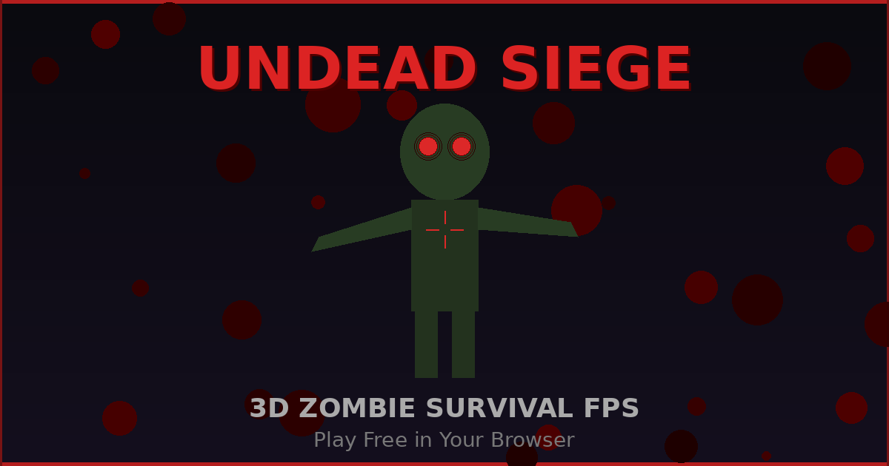

# 🧟 UNDEAD SIEGE 3D

### A love letter to Call of Duty Zombies — built entirely through AI conversation



<div align="center">

[](https://itsababseh.github.io/undead-siege-3d/)

</div>

---

## 🔫 Features

### Combat & Weapons
- **4 Iconic Weapons** — M1911 (starter), MP40, Trench Gun, Ray Gun — each with unique recoil profile, muzzle flash, and tracer
- **Mystery Box** — Spend 950 points for a random weapon drop with animated spin reveal; 8-second collect window; rolling the gun you already hold gives you a free max-ammo refill instead
- **Pack-a-Punch** — Upgrade any weapon for 5000 points: boosted damage, bigger mags, animated camo & graffiti overlay
- **Knife System** — Dedicated melee attack with swing animation, cooldown, and satisfying slash SFX
- **Weapon Quick-Swap** — Press Q to instantly toggle between your last two weapons
- **Per-Weapon Recoil** — Every gun has hand-tuned kick, barrel rise, and settle behavior
- **Sprint** — Hold Shift while moving forward to run at 1.45× speed. Faster head-bob cadence, subtle FOV widen, and the gun lowers CoD-style to signal you're in motion
- **Last Stand (multiplayer only)** — When a teammate's HP hits 0 in MP, they drop to a prone pistol-only crawl. They can still move slowly and shoot the M1911 while waiting for a teammate to revive them. Solo: HP zero is final — there's nobody to revive you

### Perks (90s timed duration unless noted, CoD-style)
- **🛡️ Juggernog** — 3-hit absorbing shield. Zombies eat the shield before your HP (2500 pts)
- **❤️ Health** — Permanent +75 max HP for the rest of the run (2500 pts, no timer)
- **⚡ Speed Cola** — 2× faster reload (3000 pts)
- **🔥 Double Tap** — 2× fire rate (2000 pts)
- **💉 Quick Revive** — HP regen + 4× faster ally revives (1500 pts)
- **Stylized HUD Pills** — Each perk appears as a pill-shaped button with emoji, label, time-drain fill, and pulsing warning when <5s remain
- **Down = Wipe** — Timed buffs clear when you go down. Permanent perks (Health) survive

### Enemies & AI
- **Dynamic Pathfinding** — Wall collision with body-radius margin so zombies never clip through geometry
- **Separation Forces** — Boid-like horde behavior so zombies don't stack on top of each other
- **Stuck Detection + Nudge** — Line-of-sight checked teleport that never tunnels through walls
- **Boss Zombies** — Every 5th round spawns a boss with ground pound, zigzag, and phase-based abilities
- **Elite Zombies** — 15% chance past round 3: 2.5× HP, 1.15× speed, 1.8× damage
- **Limping System** — Damaged zombies develop randomized limps that affect their stride
- **Tier System** — CoD-style difficulty jumps every 5 rounds (speed, HP, damage scaling)
- **Zone-Aware Spawning** — Zombies never spawn in sealed rooms (West Wing / East Chamber) before their doors are bought

### World & Exploration
- **Full 3D Environment** — Three.js-powered with textured walls, floors, cinematic fog, and atmospheric lighting
- **Buyable Doors** — West Wing (1250 pts) & East Chamber (2000 pts) unlock new areas with fresh spawn points
- **Easter Egg Quest** — Activate generators in the correct sequence, collect the catalyst, complete the ritual
- **Power-Up Drops** — Nuke, Insta-Kill, Double Points, Max Ammo with stylized animated pill UI. Drop rate scales with the round and a pity timer guarantees one every 18 kills so dry streaks are impossible
- **Vibe Jam Portals** — Interdimensional caution-tape portal built into the wall that transports you to other Vibe Jam 2026 games. Hit browser back to resume your run — SP resumes paused on the same round, MP attempts to rejoin the lobby or shows the squad-wipe summary
- **Subtle Cinematic Vignette** — Always-on film-style edge falloff that doesn't darken gameplay
- **Progressive Low-HP Tint** — Screen edges tint red as your HP drops (quadratic curve below 60%). Critical heartbeat pulse kicks in under 15%

### Multiplayer (real-time up to 5 players)
- **Lobby System** — Create public/private, join by invite code, or browse the public lobby list
- **Host Authority** — One client per lobby runs zombie AI and streams positions at 20 Hz; HP is server-authoritative via SpacetimeDB
- **Synced Weapon Models** — Remote players' soldier models show the actual weapon they're holding (pistol, SMG, shotgun, ray gun)
- **Downed & Revive** — Go down when HP hits 0, teammates hold E within 3 units to revive; 2-second post-revive grace window
- **Spectator Mode** — Mid-match joiners spectate until the next round starts
- **In-Game Chat** — Press T to type, filtered UI, per-lobby scoped
- **Squad Wipe Summary** — Full run stats + global leaderboard placement shown when the whole squad goes down
- **Global MP Leaderboard** — Squad rosters with all player names stored together; top 5 shown on main menu with 👥 prefix for multi-player runs

### Quality of Life
- **Redesigned Reload UI** — Spinning indicator + countdown + shimmering gradient bar embedded in the ammo box (no more overlapping HUD elements)
- **Minimap** — Real-time tactical overview with zombie positions, doors, perks, and interactable icons
- **Player Ranks** — Earn military ranks (Recruit → Corporal → Sergeant → …) based on cumulative performance
- **Local + Global Leaderboards** — Personal top-5 cached in localStorage; global top-5 streamed from SpacetimeDB
- **Mobile Support** — Full touch controls with virtual joystick, fire button, reload button, and weapon switcher
- **Procedural Audio** — Every SFX synthesized via Web Audio API (no audio files needed, instant load)
- **Ambient Soundscape** — Dynamic eerie atmosphere that adapts to proximity and gameplay state
- **Radio Transmissions** — Story-driven audio logs triggered on specific rounds
- **Theme-Aware Branding** — Logo auto-switches between light and dark versions to match GitHub reader's theme

### Recently Polished (April 2026)
- **Brightness tuned for production** — Playable in any lighting condition while preserving the spooky zombie atmosphere
- **Boss round distinction** — Every 5th round now shows a distinctive `⚠ BOSS ROUND N` banner with brighter red glow
- **Gun recoil state fix** — No more stuck-forward gun after the last shot of a round
- **Mystery box pickup** — Weapon swap is now bulletproof; E presses during spin are buffered so "first time nothing happens" is gone; rolling your current gun is an ammo refill
- **Last zombie spawn acceleration** — Final 1–2 zombies always spawn within 0.8s and bypass the maxAlive cap
- **Zero zombie auto-kills** — Zombies now only die when shot or knifed; stuck ones get progressively stronger nudges toward the player
- **MP death pointer unlock** — Cursor is properly freed on squad wipe so overlay buttons are clickable
- **Chat gating** — T only opens chat during gameplay; lobby presses no longer steal keyboard focus
- **Portal resume** — Hit browser back after using the in-game portal and your run resumes (SP paused at the same round, MP rejoins the lobby if squad's still alive)
- **Sprint** — Hold Shift to run. Gun lowers, FOV widens, bob quickens
- **MP Last Stand** — Downed teammates drop to a prone crawl with a pistol; they can return fire while waiting for a revive (solo death stays final — no one to revive you)
- **Downed-state safeguards** — Portal, weapon swaps, and shop purchases are blocked while downed so a revivable player can't accidentally escape or grief
- **Pause is single-player only** — In MP the world is shared and the server keeps simulating. ESC unlocks the cursor and shows a small "click to refocus" hint at the top of the screen instead of a full pause overlay; you keep taking damage if zombies are on you. SP still pauses fully on ESC

---

## 🎮 Controls

| Action | Desktop | Mobile |
|--------|---------|--------|
| Move | WASD | Virtual Joystick |
| Sprint | Shift | — |
| Look | Mouse | Touch Drag |
| Shoot | Left Click | Fire Button |
| Reload | R | R Button |
| Buy / Interact | E | E Button |
| Knife / Melee | F | F Button |
| Switch Weapons | 1-4 | Weapon Buttons |
| Quick Swap | Q | — |
| Chat (MP) | T | — |
| Pause (SP only) | ESC | — |

---

## ⚙️ Tech Stack

| Layer | Technology |
|-------|-----------|
| 3D Engine | Three.js 0.162 (ES6 modules via CDN importmap) |
| Camera | Custom FPS controller (no PointerLockControls — avoids roll drift) |
| Audio | Web Audio API — 100% procedural, zero audio files |
| Networking | SpacetimeDB real-time multiplayer (Rust backend, WASM reducers) |
| Textures | Procedurally generated canvas textures (no external image assets) |
| Build | esbuild bundler — single inlined HTML, no runtime bundler cost |
| Deployment | GitHub Pages with auto-deploy workflow on push |
| Code | 100% AI-generated through continuous conversation |

---

## 📁 Project Structure

```
undead-siege-3d/
├── index.html                     # Single-file entry point
├── styles/main.css                # All HUD & UI styling
├── src/
│   ├── main.js                    # Game loop, scene init, wiring
│   ├── core/state.js              # Mutable shared state (player, game, entities)
│   ├── audio/index.js             # Web Audio SFX synthesizer
│   ├── entities/zombies.js        # Zombie sprites, AI, animations
│   ├── models/guns.js             # First-person gun meshes + recoil
│   ├── effects/                   # VFX, atmosphere, damage numbers
│   ├── gameplay/                  # Mystery box, Pack-a-Punch, power-ups, buying, shooting
│   ├── world/                     # Map, textures, props, story, portal
│   ├── ui/                        # HUD, menu, minimap, loading, ranks
│   └── netcode/                   # SpacetimeDB client, host sync, revive, remote players
├── server/                        # Rust SpacetimeDB module (multiplayer backend)
└── scripts/build.mjs              # esbuild bundler → dist/index.html
```

---

## 📖 The Story

Some games are built in studios. This one was built in a conversation.

I grew up playing Call of Duty Zombies with my friends — those late nights where the outside world faded and all that mattered was surviving one more round. What most people found fearful was peace to me. The dark corridors, the relentless waves, the desperate scramble for a weapon upgrade — that was my escape. That was home.

Years later, I found myself sitting in front of a screen, talking to an AI. Not writing code line by line — *talking*. Describing what I remembered, what I felt, what I wanted to recreate. And watching it come to life, piece by piece, through a single continuous conversation with **[AutoPilot](https://agpt.co)**, a product built by the **AutoGPT** team.

Every weapon sound you hear? Synthesized from a description like *"make the knife sound crispier, like the Black Ops 1 slash."* Every mechanic — the mystery box, Pack-a-Punch with its animated camo, the perk machines with their glowing panels — brought to life not through months of development, but through iterative dialogue. *"Add perk expiration timers."* Done. *"The last zombie is getting stuck and the round won't end."* Fixed. *"Put graffiti on the Pack-a-Punched guns like they had in the original."* Built.

This game is my love letter to every late-night zombies session. To every friend who clutched a revive in the last second. To every argument about which perk to buy first. CoD Zombies was never just a game to us — it was a ritual.

With AutoPilot from AutoGPT, I didn't just recreate what I remembered — I built upon the parts that frustrated me, added what I always wished existed, and created something my friends and the community can collectively enjoy. What once required a team and months of work, I built through conversation. One message at a time. One round at a time.

Welcome to Undead Siege. The undead are waiting.

*— A childhood dream, rebuilt through AI*

---

<div align="center">

<p>Built with <a href="https://agpt.co"><picture><source media="(prefers-color-scheme: dark)" srcset="autogpt-logo-light.png"><source media="(prefers-color-scheme: light)" srcset="autogpt-logo-dark.png"></picture></a></p>

</div>
